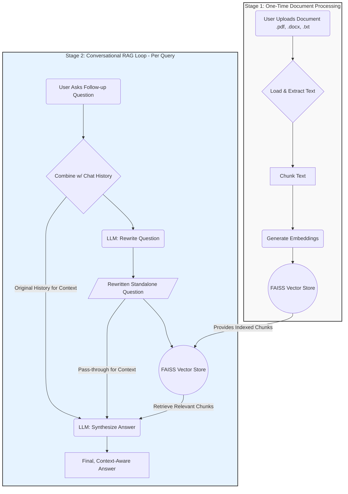

# 📄 DocuQuery: Your Conversational Document Assistant

An advanced, conversational AI assistant designed to let you chat with your documents. `DocuQuery` goes beyond simple Q&A by leveraging a history-aware RAG pipeline, enabling natural, multi-turn conversations about the contents of PDF, Word, and text files.


---

### 📋 Table of Contents

*   ✨ **[Features](#-features)**
*   🏛️ **[Core Architecture](#️-core-architecture)**
*   ➡️ **[How It Works: A Step-by-Step Example](#️-how-it-works-a-step-by-step-example)**
*   🛠️ **[Technical Stack](#️-technical-stack)**
*   📂 **[Project Structure & Key Files](#-project-structure--key-files)**

---

## ✨ Features

### 🗣️ Conversational Intelligence

*   **Context-Aware Memory**: Remembers the flow of the conversation, allowing for natural follow-up questions, pronoun resolution, and contextual understanding.
*   **History-Aware Retrieval**: The core of the system. Automatically rewrites ambiguous user follow-ups into detailed, standalone questions to ensure the highest possible retrieval accuracy.
*   **Smart Processing Modes**:
    *   **🤖 Automatic Mode**: Analyzes the document's size and complexity to determine the optimal text chunking strategy.
    *   **🔧 Manual Mode**: Provides full control to power users for fine-tuning chunk size and overlap.

###  UX & Interface

*   **🔍 Source-Backed Answers**: Every AI-generated answer is accompanied by an expandable "View Sources" section, showing the exact text snippets from the document that were used as context.
*   **📂 Multi-Format Support**: Natively handles `.pdf`, `.docx`, and `.txt` files.
*   **⚡ Session Management**:
    *   **Clear Chat**: A dedicated button to instantly reset the conversation and start a new line of inquiry on the same document.
    *   **Download History**: Export the entire conversation to a `.txt` file for easy reference and sharing.

---

## 🏛️ Core Architecture

The application's intelligence lies in its **Two-Stage Conversational RAG Architecture**. This design separates the heavy, one-time document processing from the fast, interactive conversational loop.



### **Stage 1: The Indexer (One-Time Processing)**

When a document is first uploaded, it undergoes a comprehensive indexing pipeline. This is the most computationally expensive part of the process, but it is performed **only once per document**.

*   **Process**:
    1.  The document is loaded and its raw text is extracted.
    2.  The text is strategically split into small, overlapping chunks. The application intelligently selects the chunk size automatically based on document length but allows for manual override.
    3.  Each chunk is passed to the Google Gemini embedding model, which converts its semantic meaning into a numerical vector.
    4.  All vectors are stored and indexed in a highly efficient, in-memory **FAISS vector store**.
*   **Benefit**: This upfront investment creates a searchable knowledge base that enables millisecond-fast document retrieval during the conversation.

#### **Stage 2: The Conversational Agent (RAG Loop)**

This is where the magic happens. Instead of a simple query, the system engages in a multi-step reasoning process for every question.

*   **Process**:
    1.  **Contextualize**: The user's latest question (e.g., "How does that work with LangChain?") is combined with the history of the conversation.
    2.  **Rewrite for Retrieval**: This is the key step. The combined context is sent to a Gemini LLM with a single, crucial instruction: "Rewrite this into a standalone question." For example, the input becomes a query like: `"How does Retrieval-Augmented Generation work with LangChain?"`. This step is a deliberate engineering trade-off that prioritizes **retrieval accuracy** above all else.
    3.  **Retrieve**: The newly formulated, self-contained question is used to perform a similarity search against the FAISS vector store, retrieving the most relevant document chunks.
    4.  **Synthesize**: A final LLM call is made. It receives two distinct sets of information:
        *   **Factual Grounding**: The retrieved document chunks from the step above.
        *   **Conversational Context**: The original user question and the full chat history.
        *   **This separation is critical**: The retriever gets a clean, rewritten query to find the best facts, while the final LLM gets the full history to formulate an answer that is not only factually correct but also natural and contextually appropriate.

---

## ➡️ How It Works: A Step-by-Step Example

Let's trace a multi-turn conversation to see the architecture in action.

**1. Initial Question**
> **User**: "What is Retrieval-Augmented Generation?"
> **Oracle**: Retrieves relevant chunks about RAG and provides a concise definition based on the document's content.

**2. Follow-up Question**
> **User**: "does that work with langchain?"
> **Oracle (Internal Rewriting - Stage 2)**:
> *   *Input to Rewriter*: `History: [User: "What is RAG?", AI: "..."]`, `New Question: "does that work with langchain?"`
> *   ***Rewritten Standalone Question***: `"How does Retrieval-Augmented Generation (RAG) work with LangChain?"`

**3. Final Answer**
> The rewritten question is used to find the most accurate documents.
> **Oracle**: "Yes, Retrieval-Augmented Generation is one of the most powerful applications of LangChain. The framework provides all the necessary components to build RAG systems, combining language models with external knowledge bases."

---

## 🛠️ Technical Stack

| Component                | Technology                                         | Purpose                                                      |
| ------------------------ | -------------------------------------------------- | ------------------------------------------------------------ |
| **Framework**            | Streamlit                                          | Building the interactive web application interface.          |
| **LLM Orchestration**    | LangChain                                          | Managing the complex agentic workflows and prompt chains.    |
| **LLM & Embeddings**     | Google Gemini API (`gemini-2.5-flash`)      | Powering question rewriting, answer synthesis, and text embeddings. |
| **Vector Store**         | FAISS (In-Memory)                                  | High-speed similarity search for document retrieval.         |
| **Interface**            | Streamlit Chat                                     | Creating the conversational chat UI.                         |
| **State Management**     | `st.session_state`                                 | Persisting the RAG chain and chat history between interactions. |

---

## 📂 Project Structure & Key Files

The project follows a modular structure to ensure a clean separation of concerns.

```
docuquery/
├── .streamlit/
│   └── config.toml
├── assets/
│   └── styles.css
├── components/
│   └── sidebar.py
├── core/
│   └── rag_core.py
└── app.py
```

*   **`app.py`**: The main application entry point. It orchestrates the UI, manages session state, and handles the overall application flow.
*   **`core/rag_core.py`**: The "engine room." This module contains all the core logic for the RAG pipeline, including document processing and the creation of the conversational chain. It is completely decoupled from the Streamlit UI.
*   **`components/sidebar.py`**: Encapsulates all the code and logic for rendering the settings and actions in the sidebar, keeping the main app file cleaner.
